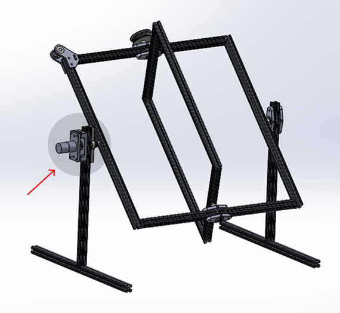

# RotoCaster

RotoCaster is a machine that keeps a mold rotating on two axes at the same time. As liquid resin or heated plastic moves inside, it spreads evenly over the inner walls of the mold and hardens, leaving the center empty.

This project focuses on the engine that drives the rotating axis highlighted in the image below.


> *Image credit: The main image was adapted from https://www.tannereng.com/rotocaster*

## Prototype

<video src="assets/rotocaster.mp4" controls muted playsinline></video>

# Implementation

A Python-based GUI application for managing and executing rotary motion profiles. RotoCaster allows users to create, edit, and run profiles consisting of multiple steps that control rotation speed, duration, and direction.

## Features

- **Profile Management**: Create, edit, and delete rotation profiles
- **Step Configuration**: Define steps with configurable speed, duration, and rotation direction
- **Profile Execution**: Run profiles with real-time monitoring
- **Manual Mode**: Execute individual rotation operations manually
- **Settings**: Configure application preferences
- **Microcontroller Integration**: Support for hardware control via microcontroller

## Project Structure

```
rotocaster/
├── main.py                 # Application entry point
├── micro_controller.py     # Microcontroller integration
├── requirements.txt        # Python dependencies
└── src/
    ├── app.py             # Main application window
    ├── components/        # Custom UI components
    ├── controllers/       # Application logic controllers
    ├── types/             # Data structures
    ├── utils/             # Utility functions and managers
    └── views/             # UI windows and dialogs
```

## Requirements

- Python 3.8+
- customtkinter 5.2.2
- darkdetect 0.8.0
- packaging 25.0

## Installation

1. Clone the repository:
```bash
git clone <repository-url>
cd rotocaster
```

2. Install dependencies:
```bash
pip install -r requirements.txt
```

## Usage

Run the application:
```bash
python main.py
```

### Main Window

The main window provides quick access to profile management features:

- **Profile Selection**: Choose an active profile from the dropdown menu
- **Add Profile**: Create a new rotation profile
- **Edit Profile**: Modify an existing profile's steps
- **Delete Profile**: Remove a profile
- **Run Profile**: Execute a selected profile
- **Manual Mode**: Perform individual rotation operations
- **Settings**: Configure application preferences

### Creating a Profile

1. Click "Dodaj profil" (Add Profile) button
2. Enter a profile name
3. Add steps to the profile by specifying:
   - Speed (rotation speed)
   - Duration (time the step runs)
   - Direction (rotation direction)

### Running a Profile

1. Select a profile from the dropdown menu
2. Click "Uruchom profil" (Run Profile) to execute all steps in sequence

### Manual Mode

Use the manual mode to perform individual rotation operations without creating a full profile.

## Architecture

### Core Components

#### Context
The central dependency container and application state manager. Context is initialized once at startup and provides access to all major application components:
- **ProfilesFile**: Handles persistent storage and loading of profiles from disk
- **ProfilesManager**: Manages in-memory profile state and operations
- **StepsManager**: Handles step operations and transformations
- **Engine**: Manages hardware control and execution

This singleton-like pattern ensures consistent state management across the entire application.

#### ProfilesManager
Manages the complete lifecycle of rotation profiles:
- **In-memory storage**: Maintains an active dictionary of all profiles with their associated steps
- **Active profile tracking**: Keeps track of the currently selected profile for execution
- **CRUD operations**: Create, read, update, and delete profiles with validation
- **Profile listing**: Retrieves sorted lists of all available profiles
- **Persistence integration**: Works with ProfilesFile to load/save changes

Key responsibilities:
- Prevent duplicate profile names
- Ensure an active profile is always selected when available
- Provide convenient access to active profile steps
- Support profile renaming operations

#### Engine
The core execution and hardware control component. Manages real-time rotation control with sophisticated speed management:

**Speed Control**:
- **Easing algorithm**: Implements acceleration/deceleration curves for smooth speed transitions
- **Increment/Decrement**: Gradually increases or decreases speed to target values
- **Reset**: Safely brings speed to zero with exponential decay

**Threading**: 
- Runs speed transitions asynchronously without blocking the UI
- Uses Python threading and Event objects for synchronization
- Supports both blocking and non-blocking operation modes

**Hardware Communication**:
- Continuously streams speed and direction commands to the microcontroller
- Formats messages as `engine:<direction>;<speed>` for board transmission
- Respects configurable communication delays (default 0.2s)

**State Management**:
- Tracks current speed, target speed, direction, and stop flags
- Provides graceful shutdown with `turn_off()` method

#### StepsManager
Handles step-level operations for profiles. Manages the creation, modification, and retrieval of individual steps within profiles.

#### Timer & Stopwatch
Execution time controllers:
- **Timer**: Manages step duration and countdown
- **Stopwatch**: Tracks elapsed time during profile execution

#### Queue
Execution queue management:
- Queues steps for sequential execution
- Ensures proper ordering and timing of profile steps
- Coordinates with Engine for actual hardware control

### Data Flow

```
User Input (Views)
       ↓
ProfilesManager (State)
       ↓
StepsManager (Step Operations)
       ↓
Engine (Hardware Control)
       ↓
Microcontroller (Hardware)
```

### Data Structures

- **ProfileStruct**: Contains a dictionary of steps indexed by step ID, allowing flexible step organization
- **StepStruct**: Represents a single rotation operation with speed (int), time (timedelta), and direction (str)
- **AxisDirection**: Enum defining rotation directions (e.g., LEFT, RIGHT)

## Development

### Custom Components

Custom tkinter components are located in `src/components/` and provide consistent styling across the application.

### Views

Each view (add, edit, delete, run) is implemented as a separate class for modular UI management.

### Utilities

Helper functions and managers are centralized in `src/utils/` for easy maintenance and reuse.
